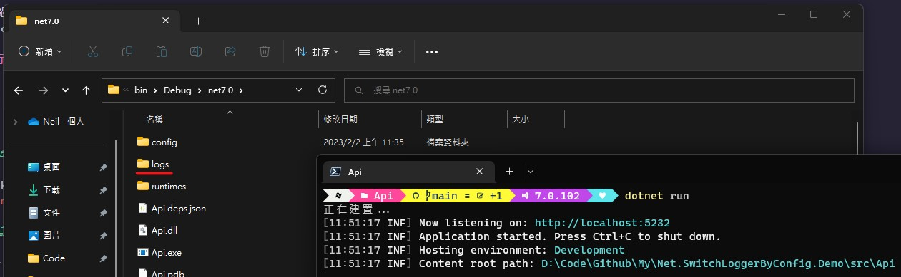
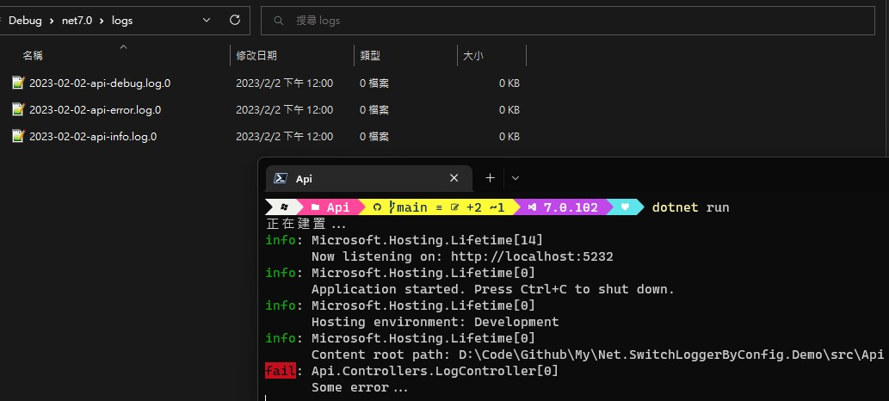

# Net.SwitchLoggerByConfig.Demo

練習透過組態切換 Logger 機制於 .NET 上。  
To practice how switch logger by config on .NET.

## 運行專案

> 透過 Visual Studio 2022 或者利用 `dotnet run` 指令先把專案跑起來。

1. Run the project from Visual Studio 2022 or by typing `dotnet run` in a command window.

> 回到命令列視窗，你將會看到以下訊息（目前使用 Serilog）：

2. Back to command window, your will see the message (currently use serilog):  
   
   

> 至 http://localhost:5232 並觸發寫記錄。

3. Go to http://localhost:5232 and trigger write log.
   
   

> 嘗試修改 `logsettings.Development.json` 來使用 NLog。

4. Try to modify `logsettings.Development.json` below setting to use NLog.

   ```json
   {
     "CoreLoggerOptions": {
       "LoggerType": "NLog",
       "NLogOptions": {
         "ConfigFilePath": "config/nlog.config"
       }
     },
     "Logging": {
       "LogLevel": {
         "Default": "Information",
         "Microsoft.AspNetCore": "Warning"
       }
     }
   }
   ```

   

> 嘗試修改 `logsettings.Development.json` 來使用 log4net。

5. Try to modify `logsettings.Development.json` below setting to use log4net.
   ```json
   {
     "CoreLoggerOptions": {
       "LoggerType": "Log4Net",
       "Log4NetOptions": {
         "ConfigFilePath": "config/log4net.config"
       }
     },
     "Logging": {
       "LogLevel": {
         "Default": "Information",
         "Microsoft.AspNetCore": "Warning"
       }
     }
   }
   ```
   

> 自己試試吧。

6. Try it yourself.
